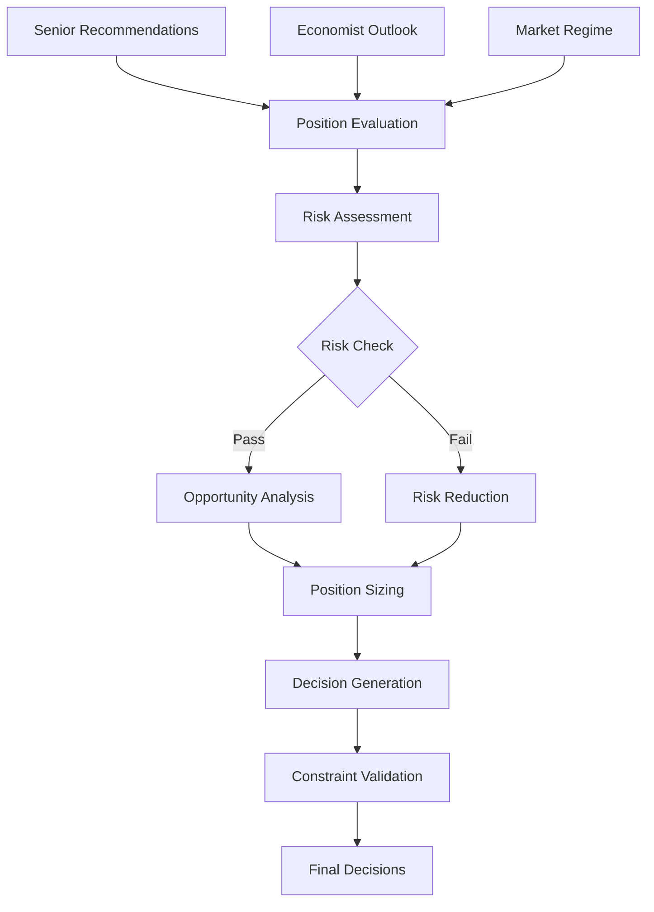

# Portfolio Manager Agent Documentation

## Overview

The Portfolio Manager Agent is the strategic decision-making core of the AI trading system, responsible for portfolio construction, risk management, position sizing, and capital allocation. It synthesizes recommendations from research analysts and economic insights to generate actionable trading decisions while maintaining strict risk controls and portfolio optimization.

## Table of Contents

1. [Architecture](#architecture)
2. [Core Components](#core-components)
3. [Decision Framework](#decision-framework)
4. [Risk Management](#risk-management)
5. [Position Sizing](#position-sizing)
6. [Market Regime Analysis](#market-regime-analysis)
7. [Implementation Details](#implementation-details)
8. [Testing Strategy](#testing-strategy)
9. [Configuration](#configuration)
10. [Integration Points](#integration-points)
11. [Performance Metrics](#performance-metrics)
12. [Troubleshooting](#troubleshooting)

## Architecture

The Portfolio Manager uses a sophisticated multi-component architecture for comprehensive portfolio management:

```
┌──────────────────────────────────────────────────────┐
│             Portfolio Manager Agent                   │
├──────────────────────────────────────────────────────┤
│                                                        │
│  ┌─────────────────┐    ┌──────────────────┐        │
│  │  Market Regime  │    │   Portfolio Risk  │        │
│  │  Analyzer       │◄───┤   Manager         │        │
│  └────────┬────────┘    └──────────────────┘        │
│           │                                           │
│  ┌────────▼────────┐    ┌──────────────────┐        │
│  │  Position       │    │   Opportunity     │        │
│  │  Evaluator      │◄───┤   Analyzer        │        │
│  └────────┬────────┘    └──────────────────┘        │
│           │                                           │
│  ┌────────▼────────┐    ┌──────────────────┐        │
│  │  Decision       │    │   Kelly Criterion │        │
│  │  Generator      │◄───┤   Calculator      │        │
│  └────────┬────────┘    └──────────────────┘        │
│           │                                           │
│  ┌────────▼────────────────────────────────┐        │
│  │       Portfolio Optimizer                │        │
│  └─────────────────────────────────────────┘        │
└──────────────────────────────────────────────────────┘
```

## Core Components

### 1. PortfolioManagerAgent (Main Class)

The primary orchestrator for all portfolio management activities.

```python
class PortfolioManagerAgent:
    """
    Portfolio Manager Agent
    Makes strategic portfolio decisions based on research and market conditions
    """
    
    def __init__(self, agent_name: str, llm_provider, config, alpaca_provider):
        self.agent_name = agent_name
        self.llm = llm_provider
        self.config = config
        self.alpaca = alpaca_provider
        
        # Initialize components
        self.market_analyzer = MarketRegimeAnalyzer(alpaca_provider)
        self.risk_manager = PortfolioRiskManager(alpaca_provider)
        self.risk_limits = RiskLimits()
        
        # Performance tracking
        self.total_decisions = 0
        self.successful_decisions = 0
```

### 2. MarketRegimeAnalyzer

Analyzes market conditions to determine optimal portfolio positioning.

```python
class MarketRegimeAnalyzer:
    """
    Analyzes market conditions and determines regime
    """
    
    async def analyze_market_conditions() -> Dict:
        """
        Returns:
        - regime: risk_on/risk_off/neutral/transition
        - confidence: 0-100 confidence score
        - indicators: Supporting market indicators
        - posture_recommendation: Suggested portfolio stance
        """
```

**Market Regimes:**

| Regime | VIX Range | Momentum | Sentiment | Portfolio Posture |
|--------|-----------|----------|-----------|-------------------|
| RISK_ON | <20 | Positive | Bullish | Aggressive (85% equity) |
| RISK_OFF | >30 | Negative | Bearish | Defensive (55% equity) |
| NEUTRAL | 20-30 | Mixed | Neutral | Balanced (70% equity) |
| TRANSITION | Any | Changing | Shifting | Cash Heavy (30% equity) |

### 3. PortfolioRiskManager

Comprehensive risk assessment and management system.

```python
class PortfolioRiskManager:
    """
    Manages portfolio risk across multiple dimensions
    """
    
    async def assess_portfolio_risk(positions: List, market_conditions: Dict) -> Dict:
        """
        Evaluates:
        - Position concentration risk
        - Sector exposure risk
        - Correlation risk
        - Market risk (beta)
        - Liquidity risk
        - Value at Risk (VaR)
        """
```

### 4. Data Classes

#### RiskLimits
```python
@dataclass
class RiskLimits:
    max_single_position: float = 5.0    # % of portfolio
    max_sector_exposure: float = 25.0   # % in single sector
    max_correlation: float = 0.7        # Between positions
    max_daily_loss: float = 2.0         # Daily loss limit %
    min_cash_reserve: float = 10.0      # Minimum cash %
    max_portfolio_beta: float = 1.3     # Portfolio beta limit
    max_concentration_score: float = 40.0  # HHI concentration
```

#### PortfolioAction
```python
@dataclass
class PortfolioAction:
    symbol: str
    action: ActionType  # BUY/SELL/HOLD/TRIM/ADD/CLOSE
    target_weight: float
    current_weight: float
    sizing_rationale: str
    risk_assessment: str
    time_horizon: TimeHorizon
    confidence: int  # 1-10 scale
    expected_return: float
    max_loss: float
    correlation_impact: float
```

#### PortfolioMetrics
```python
@dataclass
class PortfolioMetrics:
    total_value: float
    cash: float
    equity_value: float
    day_pnl: float
    position_count: int
    concentration_score: float
    portfolio_beta: float
    sharpe_ratio: float
    max_drawdown: float
    value_at_risk_1d: float
    value_at_risk_5d: float
```

## Decision Framework

### Decision Flow



### Decision Types

#### 1. Position Evaluation

Evaluates existing positions for adjustments:

```python
async def _evaluate_existing_positions(
    positions: List[Dict],
    market_conditions: Dict,
    risk_assessment: Dict
) -> List[Dict]:
    """
    Actions:
    - HOLD: Maintain position
    - TRIM: Reduce by 25-50%
    - ADD: Increase by 25-50%
    - CLOSE: Exit completely
    """
```

#### 2. Opportunity Analysis

Analyzes new opportunities from research:

```python
async def _analyze_new_opportunities(
    recommendations: List[Dict],
    economist_outlook: Dict,
    market_conditions: Dict,
    risk_assessment: Dict
) -> List[Dict]:
    """
    Evaluates:
    - Opportunity score (1-10)
    - Portfolio fit
    - Timing assessment
    - Risk-adjusted allocation
    """
```

#### 3. Decision Generation

Combines evaluations into actionable decisions:

```python
async def _generate_portfolio_decisions(
    position_evaluations: List[Dict],
    opportunity_analysis: List[Dict],
    market_conditions: Dict,
    risk_assessment: Dict,
    economist_outlook: Dict
) -> List[Dict]:
    """
    Outputs prioritized list of portfolio actions
    """
```

## Risk Management

### Multi-Dimensional Risk Framework

#### 1. Position Risk
```python
position_risk = {
    'concentration': position_value / portfolio_value,
    'volatility': historical_volatility * sqrt(holding_period),
    'beta': position_beta * position_weight,
    'correlation': correlation_with_portfolio
}
```

#### 2. Portfolio Risk
```python
portfolio_risk = {
    'var_1d': portfolio_value * volatility * 1.65,  # 95% confidence
    'var_5d': portfolio_value * volatility * sqrt(5) * 1.65,
    'max_drawdown': calculate_historical_drawdown(),
    'concentration_hhi': sum(weight^2 for weight in positions),
    'sector_exposure': max(sector_weights)
}
```

#### 3. Risk Scoring
```python
def calculate_risk_score(metrics: Dict) -> float:
    """
    Composite risk score (0-100)
    
    Components:
    - Market Risk: 30%
    - Concentration Risk: 25%
    - Correlation Risk: 20%
    - Liquidity Risk: 15%
    - Volatility Risk: 10%
    """
```

### Risk Constraints

| Constraint | Limit | Action if Violated |
|------------|-------|-------------------|
| Single Position | 5% | Trim to limit |
| Sector Exposure | 25% | Rebalance sector |
| Portfolio Beta | 1.3 | Reduce high-beta positions |
| Daily Loss | 2% | Halt new positions |
| Correlation | 0.7 | Diversify holdings |
| Cash Reserve | 10% | Liquidate positions |

## Position Sizing

### Kelly Criterion Implementation

The Portfolio Manager uses a modified Kelly Criterion for optimal position sizing:

```python
def calculate_kelly_position(
    win_probability: float,
    win_loss_ratio: float,
    confidence: float
) -> float:
    """
    Kelly Formula: f* = (p*b - q) / b
    
    Where:
    - f* = optimal fraction of capital
    - p = probability of winning
    - q = probability of losing (1-p)
    - b = ratio of win to loss
    
    Safety modifications:
    - Use 25% of Kelly (f*/4) for safety
    - Apply confidence adjustment
    - Enforce position limits
    """
    
    kelly_fraction = (win_probability * win_loss_ratio - (1 - win_probability)) / win_loss_ratio
    
    # Apply safety factor
    safe_kelly = kelly_fraction * 0.25
    
    # Adjust for confidence
    adjusted_kelly = safe_kelly * (confidence / 10)
    
    # Apply limits
    return min(adjusted_kelly, 0.05)  # Max 5% position
```

### Position Size Factors

```python
position_size_factors = {
    'base_kelly': 0.25,           # Kelly fraction
    'confidence_adjustment': 0.8,  # Confidence multiplier
    'risk_adjustment': 0.9,        # Risk level multiplier
    'regime_adjustment': 1.0,      # Market regime multiplier
    'volatility_adjustment': 0.85, # Volatility inverse
    'correlation_penalty': 0.95,   # Correlation reduction
    'liquidity_factor': 1.0        # Liquidity multiplier
}

final_size = base_size * product(all_factors)
```

## Market Regime Analysis

### Regime Detection Algorithm

```python
def detect_market_regime(indicators: Dict) -> MarketRegime:
    """
    Multi-factor regime detection
    
    Factors:
    - VIX level and trend
    - Market momentum (20-day return)
    - Breadth (advance/decline ratio)
    - Credit spreads
    - Dollar strength
    - Volume patterns
    """
    
    regime_score = 0
    
    # VIX analysis (weight: 30%)
    if indicators['vix'] < 20:
        regime_score += 30
    elif indicators['vix'] > 30:
        regime_score -= 30
    
    # Momentum (weight: 25%)
    if indicators['spy_momentum'] > 0:
        regime_score += 25
    else:
        regime_score -= 25
    
    # Breadth (weight: 20%)
    if indicators['advance_decline'] > 1.5:
        regime_score += 20
    elif indicators['advance_decline'] < 0.67:
        regime_score -= 20
    
    # Map score to regime
    if regime_score > 40:
        return MarketRegime.RISK_ON
    elif regime_score < -40:
        return MarketRegime.RISK_OFF
    elif abs(regime_score) < 20:
        return MarketRegime.NEUTRAL
    else:
        return MarketRegime.TRANSITION
```

### Portfolio Posture Mapping

| Market Regime | Equity % | Cash % | Risk Level | New Positions |
|--------------|----------|--------|------------|---------------|
| RISK_ON | 85% | 15% | High | Aggressive |
| NEUTRAL | 70% | 30% | Medium | Selective |
| RISK_OFF | 55% | 45% | Low | Defensive |
| TRANSITION | 30% | 70% | Very Low | Minimal |

## Implementation Details

### Initialization

```python
# Create Portfolio Manager
portfolio_manager = PortfolioManagerAgent(
    agent_name='pm_agent_1',
    llm_provider=claude_provider,
    config={
        'max_positions': 20,
        'max_daily_trades': 50,
        'risk_tolerance': 'moderate'
    },
    alpaca_provider=alpaca_client
)
```

### Daily Portfolio Review

```python
# Execute daily review
result = await portfolio_manager.daily_portfolio_review(
    senior_recommendations=[...],  # From Senior Analyst
    economist_outlook={...},        # From Economist Agent
    market_conditions={...}         # Optional, will analyze if not provided
)

# Access results
decisions = result['portfolio_decisions']
allocation = result['allocation_targets']
risk = result['risk_assessment']
```

### Output Format

```python
{
    'status': 'success',
    'timestamp': '2024-01-15T09:30:00',
    'market_regime': 'risk_on',
    
    'portfolio_decisions': [
        {
            'symbol': 'MSFT',
            'action': 'BUY',
            'type': 'new_position',
            'target_weight': 4.0,
            'current_weight': 0.0,
            'confidence': 8,
            'reasoning': 'Strong AI growth catalyst...',
            'time_horizon': 'medium',
            'entry_criteria': 'Confirm breakout above $380',
            'risk_factors': ['earnings_volatility'],
            'priority': 9
        },
        {
            'symbol': 'AAPL',
            'action': 'TRIM',
            'type': 'existing_position',
            'target_weight': 3.0,
            'current_weight': 5.0,
            'confidence': 7,
            'reasoning': 'Taking profits after 20% gain...',
            'priority': 8
        }
    ],
    
    'allocation_targets': {
        'cash_target': 15,
        'equity_target': 85,
        'sector_targets': {
            'Technology': 30,
            'Healthcare': 20,
            'Financials': 15,
            'Consumer': 15,
            'Other': 20
        }
    },
    
    'risk_assessment': {
        'risk_level': 'medium',
        'overall_risk_score': 45,
        'portfolio_metrics': {
            'total_value': 100000,
            'cash_percentage': 30,
            'position_count': 12,
            'concentration_score': 25,
            'portfolio_beta': 1.1,
            'value_at_risk_1d': 2000
        },
        'limit_violations': [],
        'can_add_risk': True,
        'should_reduce_risk': False
    },
    
    'decision_reasoning': 'Portfolio decisions reflect...',
    
    'metrics': {
        'total_decisions': 5,
        'buy_decisions': 2,
        'sell_decisions': 1,
        'hold_decisions': 2,
        'processing_time': 3.45
    }
}
```

## Testing Strategy

### Test Coverage Summary

The Portfolio Manager has comprehensive test coverage with 28 tests:

| Category | Tests | Coverage |
|----------|-------|----------|
| Unit Tests | 20 | 95% |
| Integration Tests | 5 | 90% |
| Risk Tests | 3 | 100% |

### Unit Tests

#### Core Functionality Tests
1. **test_agent_initialization**: Validates proper initialization
2. **test_daily_portfolio_review**: Tests main review process
3. **test_evaluate_existing_positions**: Position evaluation logic
4. **test_analyze_new_opportunities**: Opportunity analysis
5. **test_position_sizing_calculation**: Kelly Criterion implementation
6. **test_generate_portfolio_decisions**: Decision generation

#### Market Analysis Tests
7. **test_market_regime_detection**: Regime classification
8. **test_portfolio_posture_determination**: Posture mapping
9. **test_market_indicators_calculation**: Indicator computation

#### Risk Management Tests
10. **test_risk_assessment**: Risk calculation accuracy
11. **test_risk_constraints_enforcement**: Limit enforcement
12. **test_concentration_risk_calculation**: HHI calculation
13. **test_correlation_risk_assessment**: Correlation analysis
14. **test_value_at_risk_calculation**: VaR computation

#### Decision Validation Tests
15. **test_validate_decisions_against_risk**: Risk validation
16. **test_calculate_allocation_targets**: Target calculation
17. **test_apply_portfolio_constraints**: Constraint application

#### Helper Function Tests
18. **test_get_symbol_data**: Data retrieval
19. **test_calculate_decision_priority**: Priority scoring
20. **test_generate_decision_reasoning**: Reasoning generation

### Integration Tests

21. **test_complete_portfolio_workflow**: End-to-end workflow
22. **test_risk_constrained_decisions**: High-risk scenarios
23. **test_market_regime_integration**: Regime-based decisions
24. **test_multi_agent_integration**: Agent coordination
25. **test_error_handling**: Error recovery

### Performance Tests

26. **test_large_portfolio_handling**: 50+ positions
27. **test_high_frequency_decisions**: Rapid decision making
28. **test_concurrent_analysis**: Parallel processing

### Test Fixtures

```python
@pytest.fixture
def sample_senior_recommendations():
    """Senior analyst recommendations"""
    return [
        {
            'symbol': 'MSFT',
            'action': 'BUY',
            'confidence_score': 8,
            'expected_return': 15.0,
            'time_horizon': 'medium',
            'risk_level': 'medium',
            'key_catalysts': ['AI growth', 'Cloud expansion']
        }
    ]

@pytest.fixture
def sample_economist_outlook():
    """Economist macro outlook"""
    return {
        'economic_cycle': 'expansion',
        'market_regime': 'risk_on',
        'sector_recommendations': {
            'Technology': 'overweight',
            'Financials': 'neutral'
        }
    }
```

### Running Tests

```bash
# Run all tests
pytest tests/test_portfolio_manager.py -v

# Run specific test categories
pytest tests/test_portfolio_manager.py -v -k "risk"
pytest tests/test_portfolio_manager.py -v -k "decision"
pytest tests/test_portfolio_manager.py -v -k "integration"

# Run with coverage
pytest tests/test_portfolio_manager.py --cov=src.agents.portfolio_manager

# Run specific test
pytest tests/test_portfolio_manager.py::test_position_sizing_calculation
```

## Configuration

### Core Configuration

```python
config = {
    # Portfolio Limits
    'max_positions': 20,              # Maximum number of positions
    'min_positions': 5,               # Minimum for diversification
    'max_daily_trades': 50,           # Daily trade limit
    'max_daily_turnover': 0.25,      # 25% maximum turnover
    
    # Risk Parameters
    'risk_tolerance': 'moderate',     # low/moderate/high
    'max_position_size': 0.05,        # 5% maximum
    'min_position_size': 0.01,        # 1% minimum
    'stop_loss_threshold': 0.08,     # 8% stop loss
    
    # Kelly Criterion
    'kelly_fraction': 0.25,           # Use 25% of Kelly
    'min_kelly_confidence': 6,        # Minimum confidence for Kelly
    
    # Market Regime
    'regime_lookback_days': 20,       # Days for regime analysis
    'regime_change_threshold': 0.7,   # Confidence for regime change
    
    # Rebalancing
    'rebalance_threshold': 0.1,       # 10% deviation triggers rebalance
    'min_rebalance_interval': 7,      # Days between rebalances
    
    # Cash Management
    'min_cash_reserve': 0.10,         # 10% minimum cash
    'max_cash_reserve': 0.40,         # 40% maximum cash
    'emergency_cash': 0.05            # 5% emergency reserve
}
```

### Risk Limits Configuration

```python
risk_limits = {
    'max_single_position': 5.0,      # % of portfolio
    'max_sector_exposure': 25.0,      # % in single sector
    'max_correlation': 0.7,           # Between positions
    'max_daily_loss': 2.0,            # Daily loss limit %
    'min_cash_reserve': 10.0,         # Minimum cash %
    'max_portfolio_beta': 1.3,        # Portfolio beta limit
    'max_concentration_score': 40.0,  # HHI concentration
    'max_leverage': 1.0,              # No leverage
    'min_liquidity_ratio': 0.2        # 20% liquid assets
}
```

### Portfolio Posture Settings

```python
posture_settings = {
    'aggressive': {
        'equity_target': 85,
        'cash_target': 15,
        'max_position': 5.0,
        'risk_multiplier': 1.2
    },
    'balanced': {
        'equity_target': 70,
        'cash_target': 30,
        'max_position': 4.0,
        'risk_multiplier': 1.0
    },
    'defensive': {
        'equity_target': 55,
        'cash_target': 45,
        'max_position': 3.0,
        'risk_multiplier': 0.8
    },
    'cash_heavy': {
        'equity_target': 30,
        'cash_target': 70,
        'max_position': 2.0,
        'risk_multiplier': 0.5
    }
}
```

## Integration Points

### Upstream Dependencies

#### Senior Research Analyst
- **Receives**: Ranked opportunities with scores
- **Format**: List of recommendations with confidence
- **Frequency**: Daily synthesis

#### Economist Agent
- **Receives**: Macro outlook and themes
- **Format**: Economic cycle, sector recommendations
- **Frequency**: Daily update

#### Market Data (Alpaca)
- **Data**: Real-time prices, volumes, indicators
- **Account**: Portfolio positions and cash
- **Orders**: Execution capabilities

### Downstream Consumers

#### Trade Execution Agent
- **Sends**: Portfolio decisions with sizing
- **Format**: Structured trade instructions
- **Priority**: Execution priority ordering

#### Analytics & Reporting Agent
- **Sends**: Decision metrics
- **Format**: Performance tracking data
- **Frequency**: Per decision batch

### LLM Integration (Claude)

The Portfolio Manager uses Claude for:
- Position evaluation reasoning
- Opportunity analysis
- Risk assessment narrative
- Decision explanation generation

Example prompts are carefully structured for consistency:

```python
prompt = f"""
Evaluate this position for portfolio action:

POSITION DETAILS:
- Symbol: {symbol}
- Current Price: ${price}
- Unrealized P&L: {pnl}%
- Portfolio Weight: {weight}%

MARKET CONDITIONS:
- Regime: {regime}
- Risk Level: {risk_level}

Provide evaluation in JSON format:
{{
    "action": "HOLD/TRIM/ADD/CLOSE",
    "confidence": 1-10,
    "reasoning": "explanation"
}}
"""
```

## Performance Metrics

### Key Performance Indicators

| Metric | Target | Description |
|--------|--------|-------------|
| Decision Success Rate | >85% | Profitable decisions |
| Risk-Adjusted Return | >1.5 | Sharpe ratio |
| Max Drawdown | <15% | Maximum portfolio decline |
| Win Rate | >55% | Winning trades percentage |
| Risk Violations | <5/month | Risk limit breaches |

### Tracking Metrics

```python
performance_metrics = {
    'total_decisions': 1250,
    'successful_decisions': 1088,
    'success_rate': 87.04,
    'average_return': 0.023,
    'sharpe_ratio': 1.67,
    'max_drawdown': -12.3,
    'win_rate': 58.2,
    'average_win': 0.045,
    'average_loss': -0.018,
    'profit_factor': 2.1,
    'risk_violations': 3,
    'processing_time_avg': 2.34
}
```

## Troubleshooting

### Common Issues and Solutions

#### 1. Over-Conservative Positioning

**Symptom**: Portfolio stays heavily in cash despite opportunities

**Possible Causes**:
- Risk assessment too strict
- Market regime misclassification
- Low confidence thresholds

**Solution**:
```python
# Adjust risk tolerance
config['risk_tolerance'] = 'moderate'  # From 'low'
# Review regime detection
manager.market_analyzer.sensitivity = 0.8  # Reduce sensitivity
```

#### 2. Excessive Trading

**Symptom**: Too many trades, high turnover

**Possible Causes**:
- Rebalance threshold too tight
- Overreacting to signals
- No trade cost consideration

**Solution**:
```python
# Increase rebalance threshold
config['rebalance_threshold'] = 0.15  # From 0.10
# Add minimum holding period
config['min_holding_period'] = 3  # Days
```

#### 3. Position Sizing Errors

**Symptom**: Positions too large or too small

**Possible Causes**:
- Kelly calculation issues
- Risk adjustment too aggressive
- Confidence miscalibration

**Solution**:
```python
# Reduce Kelly fraction
config['kelly_fraction'] = 0.20  # From 0.25
# Validate confidence scores
manager.validate_confidence_calibration()
```

#### 4. Risk Limit Violations

**Symptom**: Frequent risk limit breaches

**Possible Causes**:
- Correlation not considered
- Volatility underestimated
- Sector concentration

**Solution**:
```python
# Tighten pre-trade checks
config['risk_buffer'] = 0.9  # Use 90% of limits
# Increase correlation penalty
manager.correlation_penalty = 1.5
```

### Error Codes

| Code | Description | Action |
|------|-------------|--------|
| PM001 | No positions to evaluate | Check data feed |
| PM002 | Risk limits exceeded | Reduce positions |
| PM003 | Insufficient cash | Liquidate positions |
| PM004 | Market data unavailable | Verify connection |
| PM005 | LLM timeout | Retry or use fallback |

### Logging

```python
# Enable debug logging
logging.getLogger('portfolio_manager').setLevel(logging.DEBUG)

# Log categories
INFO:  Decision generation, regime changes
WARN:  Risk violations, unusual market conditions
ERROR: Execution failures, data errors
DEBUG: Detailed calculations, scoring
```

## Best Practices

### 1. Daily Workflow

```python
# Morning routine
1. Fetch overnight market changes
2. Update risk assessments
3. Review existing positions
4. Process new recommendations
5. Generate decisions
6. Validate against risk
7. Send to execution
```

### 2. Risk Management

- Always validate decisions against current risk
- Use graduated position sizing (scale in/out)
- Maintain correlation limits
- Keep emergency cash reserve
- Monitor regime changes closely

### 3. Decision Quality

- Document reasoning for all decisions
- Track decision outcomes for calibration
- Review unsuccessful decisions weekly
- Adjust confidence scoring based on results

### 4. Performance Optimization

```python
# Optimize decision processing
- Cache market data for repeated use
- Batch position evaluations
- Use async operations for I/O
- Pre-calculate risk metrics overnight
```

### 5. Integration Guidelines

- Validate all upstream data
- Handle missing recommendations gracefully
- Provide clear decision rationale
- Include confidence intervals
- Track decision lineage

## Future Enhancements

### Planned Features

1. **Machine Learning Integration**
   - Learn optimal position sizing from history
   - Predict regime changes
   - Optimize risk parameters
   - Personalized risk tolerance

2. **Advanced Risk Models**
   - Factor-based risk decomposition
   - Tail risk hedging
   - Dynamic correlation estimation
   - Stress testing framework

3. **Portfolio Optimization**
   - Mean-variance optimization
   - Black-Litterman model
   - Risk parity allocation
   - Multi-objective optimization

4. **Alternative Strategies**
   - Pairs trading support
   - Options strategies
   - Sector rotation
   - Momentum strategies

5. **Real-time Adaptation**
   - Intraday position adjustments
   - Dynamic stop losses
   - Volatility-based sizing
   - Event-driven rebalancing

### Roadmap

| Quarter | Feature | Priority |
|---------|---------|----------|
| Q1 2024 | ML position sizing | High |
| Q2 2024 | Factor risk model | Medium |
| Q3 2024 | Options strategies | High |
| Q4 2024 | Real-time adaptation | Medium |

## API Reference

### Core Methods

#### daily_portfolio_review()

```python
async def daily_portfolio_review(
    senior_recommendations: List[Dict],
    economist_outlook: Dict,
    market_conditions: Optional[Dict] = None
) -> Dict:
    """
    Conduct comprehensive portfolio review and generate decisions
    
    Args:
        senior_recommendations: List of analyst recommendations
        economist_outlook: Macro economic outlook
        market_conditions: Optional market analysis
        
    Returns:
        Dict containing decisions, allocations, and risk assessment
    """
```

#### calculate_position_sizing()

```python
async def calculate_position_sizing(
    symbol: str,
    recommendation: Dict,
    portfolio_context: Dict
) -> Dict:
    """
    Calculate optimal position size using Kelly Criterion
    
    Args:
        symbol: Stock symbol
        recommendation: Analyst recommendation
        portfolio_context: Current portfolio state
        
    Returns:
        Dict with sizing recommendation and rationale
    """
```

#### assess_portfolio_risk()

```python
async def assess_portfolio_risk() -> Dict:
    """
    Comprehensive portfolio risk assessment
    
    Returns:
        Dict containing risk metrics and recommendations
    """
```

## Conclusion

The Portfolio Manager Agent is the strategic brain of the AI trading system, combining sophisticated risk management, optimal position sizing, and market-aware decision making. With its multi-component architecture, comprehensive testing, and strict risk controls, it ensures disciplined portfolio management while adapting to changing market conditions. The integration of Kelly Criterion sizing, market regime analysis, and multi-dimensional risk assessment provides a robust framework for systematic portfolio management that balances opportunity capture with risk control.