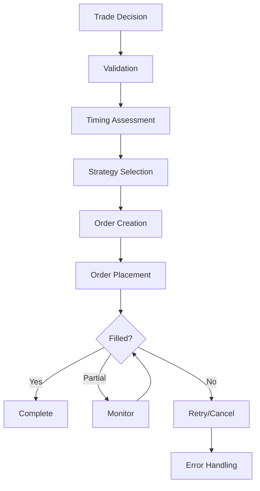

# Trade Execution Agent Documentation

## Overview

The Trade Execution Agent is the precision execution engine of the AI trading system, responsible for transforming portfolio decisions into market orders with optimal timing and minimal market impact. It implements sophisticated execution algorithms, manages order lifecycles, monitors execution quality, and ensures best execution practices while adhering to strict risk controls and daily limits.

## Table of Contents

1. [Architecture](#architecture)
2. [Core Components](#core-components)
3. [Execution Strategies](#execution-strategies)
4. [Order Management](#order-management)
5. [Market Timing](#market-timing)
6. [Execution Flow](#execution-flow)
7. [Risk Controls](#risk-controls)
8. [Testing Strategy](#testing-strategy)
9. [Configuration](#configuration)
10. [Performance Metrics](#performance-metrics)
11. [Integration Points](#integration-points)
12. [Usage Examples](#usage-examples)
13. [Troubleshooting](#troubleshooting)

## Architecture

The Trade Execution Agent employs a sophisticated multi-component architecture for optimal trade execution:

```
┌──────────────────────────────────────────────────────┐
│             Trade Execution Agent                     │
├──────────────────────────────────────────────────────┤
│                                                        │
│  ┌─────────────────┐    ┌──────────────────┐        │
│  │  Execution      │    │   Order           │        │
│  │  Timing Engine  │◄───┤   Manager         │        │
│  └────────┬────────┘    └──────────────────┘        │
│           │                                           │
│  ┌────────▼────────┐    ┌──────────────────┐        │
│  │  Strategy       │    │   Market Impact   │        │
│  │  Selector       │◄───┤   Analyzer        │        │
│  └────────┬────────┘    └──────────────────┘        │
│           │                                           │
│  ┌────────▼────────┐    ┌──────────────────┐        │
│  │  Order          │    │   Slippage        │        │
│  │  Router         │◄───┤   Monitor         │        │
│  └────────┬────────┘    └──────────────────┘        │
│           │                                           │
│  ┌────────▼────────────────────────────────┐        │
│  │       Execution Quality Tracker          │        │
│  └─────────────────────────────────────────┘        │
└──────────────────────────────────────────────────────┘
```

## Core Components

### 1. TradeExecutionAgent (Main Class)

The primary orchestrator for all execution activities.

```python
class TradeExecutionAgent(BaseAgent):
    """
    Trade Execution Agent
    Executes portfolio decisions with optimal timing
    """
    
    def __init__(self, llm_provider, alpaca_provider, config):
        super().__init__("trade_execution", llm_provider, config)
        self.alpaca = alpaca_provider
        self.timing_engine = ExecutionTimingEngine(alpaca_provider)
        self.order_manager = OrderManager(alpaca_provider)
        
        # Execution tracking
        self.daily_trades = []
        self.daily_volume = 0
        self.daily_commission = 0
        
        # Risk limits
        self.max_daily_trades = 50
        self.max_position_size = 0.05  # 5% of portfolio
        self.max_daily_turnover = 0.25  # 25% of portfolio
```

### 2. ExecutionTimingEngine

Analyzes market conditions for optimal execution timing.

```python
class ExecutionTimingEngine:
    """
    Market timing analysis for optimal execution
    """
    
    async def assess_market_timing(
        self,
        symbol: str,
        action: str
    ) -> Dict:
        """
        Assess market timing for execution
        
        Returns:
        - timing_score: 0-10 favorability
        - timing_assessment: excellent/good/fair/poor
        - recommended_strategy: Optimal execution strategy
        - optimal_execution_window: Time window
        - market_conditions: Current conditions
        - liquidity_analysis: Spread and depth
        - execution_risks: Identified risks
        - expected_slippage: Basis points
        """
```

### 3. OrderManager

Manages order lifecycle and execution strategies.

```python
class OrderManager:
    """
    Advanced order management system
    """
    
    async def execute_trade_instruction(
        self,
        instruction: TradeInstruction,
        execution_plan: ExecutionPlan
    ) -> ExecutionResult:
        """
        Execute trade with specified strategy
        
        Handles:
        - Order placement
        - Fill monitoring
        - Partial fill management
        - Timeout handling
        - Error recovery
        """
```

### 4. Data Classes

#### TradeInstruction
```python
@dataclass
class TradeInstruction:
    """Complete trade instruction from Portfolio Manager"""
    symbol: str
    action: str                    # BUY/SELL/TRIM/ADD/CLOSE
    target_weight: float           # Target portfolio weight
    current_weight: float          # Current portfolio weight
    confidence: int                # 1-10 confidence score
    time_horizon: str              # short/medium/long
    reasoning: str                 # Trade rationale
    risk_factors: List[str]        # Identified risks
    urgency: ExecutionUrgency      # LOW/MEDIUM/HIGH/URGENT
    max_slippage: float           # Maximum acceptable slippage (bps)
    execution_window: timedelta    # Time window for execution
```

#### ExecutionPlan
```python
@dataclass
class ExecutionPlan:
    """Detailed execution plan"""
    instruction: TradeInstruction
    strategy: ExecutionStrategy
    order_size: int               # Number of shares
    target_price: float           # Ideal execution price
    limit_price: Optional[float]  # Limit order price
    stop_price: Optional[float]   # Stop loss price
    chunk_size: Optional[int]     # For iceberg orders
    execution_schedule: List[datetime]  # For TWAP/VWAP
    market_timing: Dict           # Timing assessment
    expected_slippage: float      # Expected slippage (bps)
    risk_assessment: Dict         # Execution risks
```

#### ExecutionResult
```python
@dataclass
class ExecutionResult:
    """Trade execution result"""
    instruction_id: str
    symbol: str
    action: str
    requested_quantity: int
    executed_quantity: int
    average_price: float
    execution_time: timedelta
    slippage_bps: float          # Actual slippage
    market_impact: float          # Price impact
    total_commission: float
    status: OrderStatus
    fills: List[Dict]             # Individual fills
    execution_quality: str        # excellent/good/fair/poor
```

## Execution Strategies

### Strategy Types

| Strategy | Description | Use Case | Implementation |
|----------|-------------|----------|----------------|
| **MARKET** | Immediate execution | High urgency, liquid stocks | Single market order |
| **LIMIT** | Price-specific execution | Price sensitive, patient | Limit order with monitoring |
| **TWAP** | Time-weighted average | Large orders, minimize impact | Split into 8 time slices |
| **VWAP** | Volume-weighted average | Follow market volume | Dynamic slicing by volume |
| **ICEBERG** | Hidden size orders | Very large orders | Show 10% at a time |
| **OPPORTUNISTIC** | Wait for favorable prices | Low urgency, price improvement | Monitor and wait |

### Strategy Selection Logic

```python
def _recommend_execution_strategy(
    self,
    timing_score: float,
    conditions: Dict,
    liquidity: Dict,
    events: Dict
) -> ExecutionStrategy:
    """
    Select optimal execution strategy
    
    Decision Tree:
    - High timing + good liquidity → MARKET
    - Poor liquidity → VWAP
    - Volatile conditions → LIMIT
    - Event risk → OPPORTUNISTIC
    - Default → TWAP
    """
```

### TWAP Implementation

```python
async def _execute_twap_order(
    self,
    instruction: TradeInstruction,
    plan: ExecutionPlan
) -> ExecutionResult:
    """
    Time-Weighted Average Price execution
    
    Algorithm:
    1. Split order into 8 equal slices
    2. Execute over 2-hour window
    3. 15-minute intervals
    4. Track cumulative execution
    """
    
    num_slices = 8
    slice_size = plan.order_size // num_slices
    interval = timedelta(minutes=15)
    
    for i in range(num_slices):
        await self._place_order(slice_size)
        if i < num_slices - 1:
            await asyncio.sleep(interval.seconds)
```

### VWAP Implementation

```python
async def _execute_vwap_order(
    self,
    instruction: TradeInstruction,
    plan: ExecutionPlan
) -> ExecutionResult:
    """
    Volume-Weighted Average Price execution
    
    Algorithm:
    1. Analyze typical volume profile
    2. Weight execution by expected volume
    3. Execute larger slices during high volume
    4. Monitor and adjust dynamically
    """
    
    volume_profile = await self._get_volume_profile(instruction.symbol)
    execution_schedule = self._create_vwap_schedule(
        plan.order_size,
        volume_profile
    )
```

### Iceberg Orders

```python
async def _execute_iceberg_order(
    self,
    instruction: TradeInstruction,
    plan: ExecutionPlan
) -> ExecutionResult:
    """
    Hidden size execution
    
    Parameters:
    - Display Size: 10% of total
    - Refresh: When 80% filled
    - Max Iterations: 20
    """
    
    display_size = max(100, plan.order_size // 10)
    remaining = plan.order_size
    
    while remaining > 0:
        chunk = min(display_size, remaining)
        result = await self._place_order(chunk)
        remaining -= result['filled_qty']
```

## Order Management

### Order Lifecycle



### Order Validation

```python
def _validate_instruction(
    self,
    instruction: TradeInstruction
) -> Tuple[bool, Optional[str]]:
    """
    Validate trade instruction
    
    Checks:
    - Symbol validity
    - Action validity
    - Size constraints
    - Risk limits
    - Market hours
    """
    
    # Symbol validation
    if not self._is_valid_symbol(instruction.symbol):
        return False, "Invalid symbol"
    
    # Size validation
    if instruction.target_weight > self.max_position_size:
        return False, f"Position size exceeds limit: {self.max_position_size}"
    
    # Daily limits
    if not self._check_daily_limits():
        return False, "Daily trading limits exceeded"
    
    return True, None
```

### Fill Monitoring

```python
async def _monitor_order_until_filled(
    self,
    order_id: str,
    timeout: timedelta
) -> Dict:
    """
    Monitor order status until filled or timeout
    
    Process:
    1. Check status every 30 seconds
    2. Handle partial fills
    3. Timeout after specified duration
    4. Cancel if not filled
    """
    
    start_time = datetime.now()
    
    while datetime.now() - start_time < timeout:
        status = await self.alpaca.get_order(order_id)
        
        if status['status'] == 'filled':
            return status
        elif status['status'] == 'partially_filled':
            # Track partial fill
            self._track_partial_fill(order_id, status)
        elif status['status'] in ['cancelled', 'rejected']:
            break
        
        await asyncio.sleep(30)  # Check every 30 seconds
    
    # Timeout - cancel order
    await self.alpaca.cancel_order(order_id)
```

## Market Timing

### Intraday Patterns

```python
def _analyze_intraday_patterns(
    self,
    current_time: datetime
) -> Dict:
    """
    Analyze time-of-day effects
    
    Patterns:
    - Opening (9:30-9:35): High volatility, wide spreads
    - Morning (9:35-11:30): Good liquidity, trends
    - Lunch (11:30-1:30): Lower volume, drift
    - Afternoon (1:30-3:50): Resumption of trends
    - Closing (3:50-4:00): Volatility, positioning
    """
    
    hour = current_time.hour
    minute = current_time.minute
    
    # Opening volatility
    if hour == 9 and minute < 35:
        return {
            'period': 'opening',
            'volatility': 'high',
            'liquidity': 'moderate',
            'recommendation': 'wait'
        }
```

### Market Condition Assessment

```python
async def _analyze_market_conditions(
    self,
    symbol: str
) -> Dict:
    """
    Assess current market conditions
    
    Analyzes:
    - Volatility (VIX, ATR)
    - Trend strength
    - Volume profile
    - News/event risk
    """
    
    market_data = await self.alpaca.get_market_data([symbol, 'SPY'])
    
    conditions = {
        'volatility': self._calculate_volatility(market_data),
        'trend': self._assess_trend(market_data),
        'volume': self._analyze_volume(market_data),
        'events': await self._check_events(symbol)
    }
    
    return self._classify_conditions(conditions)
```

### Liquidity Analysis

```python
async def _analyze_liquidity(
    self,
    symbol: str
) -> Dict:
    """
    Analyze current liquidity conditions
    
    Metrics:
    - Bid-ask spread
    - Market depth
    - Average daily volume
    - Recent volume ratio
    """
    
    quote = await self.alpaca.get_latest_quote(symbol)
    
    spread_bps = ((quote['ask'] - quote['bid']) / quote['mid']) * 10000
    depth_score = self._calculate_depth_score(quote)
    
    return {
        'spread_bps': spread_bps,
        'depth_score': depth_score,
        'liquidity_level': self._classify_liquidity(spread_bps, depth_score),
        'liquidity_score': min(10, max(1, 10 - spread_bps))
    }
```

## Execution Flow

### Single Trade Execution

```python
async def execute_single_trade(
    self,
    trade_decision: Dict
) -> Dict:
    """
    Execute a single trade decision
    
    Flow:
    1. Convert decision to instruction
    2. Check daily limits
    3. Assess market timing
    4. Create execution plan
    5. Execute with strategy
    6. Track results
    """
    
    # Convert and validate
    instruction = self._convert_decision_to_instruction(trade_decision)
    
    # Check limits
    if not self._check_daily_limits():
        return {
            'status': 'deferred',
            'message': 'Daily trading limits reached'
        }
    
    # Timing assessment
    timing = await self.timing_engine.assess_market_timing(
        instruction.symbol,
        instruction.action
    )
    
    # Create plan
    plan = self._create_execution_plan(instruction, timing)
    
    # Execute
    result = await self.order_manager.execute_trade_instruction(
        instruction, plan
    )
    
    # Track
    self._track_daily_execution(result)
    
    return {
        'status': 'success',
        'execution_result': result,
        'summary': self._create_execution_summary(result)
    }
```

### Portfolio Batch Execution

```python
async def execute_portfolio_decisions(
    self,
    portfolio_decisions: List[Dict]
) -> Dict:
    """
    Execute multiple portfolio decisions
    
    Process:
    1. Prioritize by confidence and urgency
    2. Check aggregate limits
    3. Execute in priority order
    4. Monitor overall progress
    5. Generate batch report
    """
    
    # Prioritize decisions
    prioritized = self._prioritize_decisions(portfolio_decisions)
    
    results = []
    deferred = []
    failed = []
    
    for decision in prioritized:
        # Check if we can continue
        if not self._check_daily_limits():
            deferred.extend(prioritized[len(results):])
            break
        
        try:
            result = await self.execute_single_trade(decision)
            results.append(result)
            
            # Delay between trades
            await asyncio.sleep(2)
            
        except Exception as e:
            failed.append({
                'decision': decision,
                'error': str(e)
            })
```

## Risk Controls

### Daily Limits

```python
def _check_daily_limits(self) -> bool:
    """
    Check if daily trading limits are exceeded
    
    Limits:
    - Max trades: 50 per day
    - Max turnover: 25% of portfolio
    - Position concentration: 5% max
    """
    
    # Trade count limit
    if len(self.daily_trades) >= self.max_daily_trades:
        self.logger.warning("Daily trade limit reached")
        return False
    
    # Turnover limit
    account_value = 1000000  # Get from Alpaca
    if self.daily_volume > account_value * self.max_daily_turnover:
        self.logger.warning("Daily turnover limit reached")
        return False
    
    return True
```

### Slippage Control

```python
def _calculate_slippage(
    self,
    instruction: TradeInstruction,
    execution_result: Dict
) -> float:
    """
    Calculate execution slippage in basis points
    
    Formula:
    Slippage = (Execution Price - Expected Price) / Expected Price * 10000
    
    Positive = unfavorable (paid more for buy, received less for sell)
    """
    
    expected_price = instruction.target_price
    actual_price = execution_result['average_price']
    
    if instruction.action in ['BUY', 'ADD']:
        slippage = (actual_price - expected_price) / expected_price
    else:  # SELL, TRIM, CLOSE
        slippage = (expected_price - actual_price) / expected_price
    
    return slippage * 10000  # Convert to basis points
```

### Position Size Validation

```python
def _validate_position_size(
    self,
    instruction: TradeInstruction,
    account_value: float
) -> bool:
    """
    Validate position size constraints
    
    Checks:
    - Single position limit: 5%
    - Sector concentration: 25%
    - Correlation limits
    """
    
    position_value = instruction.target_weight * account_value / 100
    max_position_value = account_value * self.max_position_size
    
    if position_value > max_position_value:
        self.logger.error(f"Position size {position_value} exceeds limit {max_position_value}")
        return False
    
    return True
```

## Testing Strategy

### Test Coverage

The Trade Execution Agent has comprehensive test coverage with 36 tests:

| Category | Tests | Coverage |
|----------|-------|----------|
| ExecutionTimingEngine | 6 | 95% |
| OrderManager | 11 | 93% |
| TradeExecutionAgent | 12 | 94% |
| Integration | 3 | 90% |
| Edge Cases | 4 | 88% |

### Core Test Categories

#### 1. ExecutionTimingEngine Tests (6 tests)

- **test_assess_market_timing_normal**: Normal market conditions
- **test_assess_market_timing_volatile**: High volatility handling
- **test_assess_market_timing_poor_liquidity**: Wide spread scenarios
- **test_assess_market_timing_error_handling**: API failure recovery
- **test_intraday_timing_patterns**: Time-of-day effects
- **test_recommend_execution_strategy**: Strategy selection logic

#### 2. OrderManager Tests (11 tests)

- **test_execute_market_order**: Market order execution
- **test_execute_limit_order**: Limit order with pricing
- **test_execute_twap_order**: TWAP slicing (mocked sleep)
- **test_execute_vwap_order**: Volume-weighted execution
- **test_execute_iceberg_order**: Hidden size orders
- **test_execute_opportunistic_order**: Price waiting logic
- **test_monitor_order_timeout**: Timeout handling
- **test_order_validation**: Input validation
- **test_calculate_order_parameters**: Size calculation
- **test_execution_performance_tracking**: Metrics tracking
- **test_zero_quantity_order**: NO_CHANGE handling

#### 3. TradeExecutionAgent Tests (12 tests)

- **test_agent_initialization**: Component setup
- **test_execute_single_trade_success**: Single trade flow
- **test_execute_single_trade_daily_limit**: Limit enforcement
- **test_execute_portfolio_decisions**: Batch execution
- **test_monitor_active_executions**: Order monitoring
- **test_generate_execution_report**: Report generation
- **test_create_execution_plan**: Plan creation
- **test_convert_decision_to_instruction**: Conversion logic
- **test_check_daily_limits**: Risk limit validation
- **test_track_daily_execution**: Execution tracking
- **test_check_execution_alerts**: Alert generation
- **test_process_method_routing**: Task routing

### Test Fixtures

```python
@pytest.fixture
def sample_trade_instruction():
    """Sample trade instruction for testing"""
    return TradeInstruction(
        symbol='AAPL',
        action='BUY',
        target_weight=3.0,
        current_weight=0.0,
        confidence=8,
        time_horizon='medium',
        reasoning='Strong technical setup',
        risk_factors=['market_volatility'],
        urgency=ExecutionUrgency.MEDIUM,
        max_slippage=10.0,
        execution_window=timedelta(hours=2)
    )
```

### Critical Test Patterns

```python
# Mock asyncio.sleep for time-based tests
with patch('asyncio.sleep', new_callable=AsyncMock):
    result = await order_manager.execute_twap_order(instruction, plan)

# Mock order monitoring to prevent hanging
with patch.object(order_manager, '_monitor_order_until_filled',
                 new_callable=AsyncMock) as mock_monitor:
    mock_monitor.return_value = {'status': 'filled'}
```

## Configuration

### Core Configuration

```python
config = {
    # Execution Limits
    'max_daily_trades': 50,
    'max_position_size': 0.05,        # 5% of portfolio
    'max_daily_turnover': 0.25,       # 25% of portfolio
    'max_sector_exposure': 0.25,      # 25% sector limit
    
    # Order Settings
    'default_timeout_minutes': 30,
    'monitor_interval_seconds': 30,
    'max_retry_attempts': 3,
    'order_age_limit_hours': 4,
    
    # Slippage Controls
    'max_slippage_bps': 50,           # 50 basis points
    'warning_slippage_bps': 20,       # Warning threshold
    
    # Execution Windows
    'avoid_opening_minutes': 5,        # Skip first 5 minutes
    'avoid_closing_minutes': 10,       # Skip last 10 minutes
    'lunch_hour_start': '11:30',
    'lunch_hour_end': '13:30',
    
    # Strategy Parameters
    'twap_slices': 8,                 # Number of TWAP slices
    'twap_window_hours': 2,           # TWAP execution window
    'vwap_min_slices': 5,
    'vwap_max_slices': 20,
    'iceberg_display_ratio': 0.10,    # Show 10%
    'opportunistic_max_wait': 60,     # Minutes
    
    # Commission
    'commission_per_share': 0.01,
    'min_commission': 1.00
}
```

### Execution Strategy Configuration

```python
strategy_config = {
    'market': {
        'enabled': True,
        'min_liquidity_score': 7,
        'max_spread_bps': 10
    },
    'limit': {
        'enabled': True,
        'price_buffer_bps': 5,
        'timeout_minutes': 30
    },
    'twap': {
        'enabled': True,
        'num_slices': 8,
        'interval_minutes': 15,
        'randomize_timing': True
    },
    'vwap': {
        'enabled': True,
        'use_historical_volume': True,
        'lookback_days': 20,
        'min_participation': 0.01
    },
    'iceberg': {
        'enabled': True,
        'display_size_pct': 0.10,
        'refresh_threshold': 0.80,
        'max_iterations': 20
    },
    'opportunistic': {
        'enabled': True,
        'price_improvement_bps': 10,
        'max_wait_minutes': 60,
        'check_interval_seconds': 60
    }
}
```

## Performance Metrics

### Execution Quality Metrics

```python
execution_metrics = {
    'total_executions': 1250,
    'successful_executions': 1188,
    'success_rate': 95.04,
    'average_slippage_bps': 8.5,
    'positive_slippage_rate': 0.42,    # 42% favorable
    'average_execution_time': 4.3,      # minutes
    'average_fill_rate': 0.98,          # 98% filled
    'average_commission': 12.50,
    'total_commission': 15625.00,
    'market_impact_bps': 3.2,
    'execution_shortfall_bps': 11.7
}
```

### Performance Tracking

```python
def get_execution_performance(self) -> Dict:
    """
    Calculate execution performance metrics
    
    Metrics:
    - Success rate
    - Average slippage
    - Fill rate
    - Execution time
    - Commission analysis
    """
    
    if not self.execution_history:
        return {'no_data': True}
    
    total = len(self.execution_history)
    successful = sum(1 for e in self.execution_history 
                    if e['status'] == 'filled')
    
    slippages = [e['slippage_bps'] for e in self.execution_history]
    avg_slippage = np.mean(slippages)
    
    return {
        'total_executions': total,
        'successful_executions': successful,
        'success_rate': (successful / total) * 100,
        'average_slippage_bps': avg_slippage,
        'slippage_std': np.std(slippages),
        'best_execution': min(slippages),
        'worst_execution': max(slippages)
    }
```

### Execution Report Generation

```python
async def generate_execution_report(
    self,
    period_days: int = 1
) -> Dict:
    """
    Generate comprehensive execution report
    
    Includes:
    - Daily summary
    - Strategy breakdown
    - Slippage analysis
    - Cost analysis
    - Quality assessment
    """
    
    cutoff = datetime.now() - timedelta(days=period_days)
    period_trades = [t for t in self.daily_trades 
                    if t['timestamp'] > cutoff]
    
    report = {
        'period': f'{period_days} day(s)',
        'trade_count': len(period_trades),
        'total_volume': sum(t['volume'] for t in period_trades),
        'total_commission': sum(t['commission'] for t in period_trades),
        'strategy_breakdown': self._analyze_strategy_usage(period_trades),
        'slippage_analysis': self._analyze_slippage(period_trades),
        'timing_analysis': self._analyze_timing(period_trades),
        'quality_scores': self._calculate_quality_scores(period_trades)
    }
```

## Integration Points

### Upstream Dependencies

#### Portfolio Manager
- **Receives**: Trade decisions with sizing
- **Format**: Structured decision dictionary
- **Frequency**: Batch or individual

#### Market Data (Alpaca)
- **Data**: Real-time quotes and volumes
- **Orders**: Order placement and monitoring
- **Account**: Position and balance info

### Downstream Consumers

#### Analytics & Reporting Agent
- **Sends**: Execution results and metrics
- **Format**: ExecutionResult objects
- **Frequency**: Per execution

#### Risk Manager
- **Sends**: Slippage and impact data
- **Format**: Risk metrics
- **Frequency**: Real-time

### API Integration

```python
# Alpaca order placement
async def _place_alpaca_order(
    self,
    symbol: str,
    quantity: int,
    side: str,
    order_type: str,
    limit_price: Optional[float] = None
) -> Dict:
    """
    Place order through Alpaca API
    
    Parameters match Alpaca's order API
    """
    
    order_params = {
        'symbol': symbol,
        'qty': quantity,
        'side': side,
        'type': order_type,
        'time_in_force': 'day'
    }
    
    if limit_price:
        order_params['limit_price'] = limit_price
    
    return await self.alpaca.place_order(**order_params)
```

## Usage Examples

### Basic Trade Execution

```python
# Initialize agent
agent = TradeExecutionAgent(
    llm_provider=claude_provider,
    alpaca_provider=alpaca_client,
    config=config
)

# Execute single trade
decision = {
    'symbol': 'AAPL',
    'action': 'BUY',
    'target_weight': 3.0,
    'current_weight': 0.0,
    'confidence': 8,
    'reasoning': 'Strong momentum breakout'
}

result = await agent.execute_single_trade(decision)
print(f"Execution status: {result['status']}")
print(f"Fill price: ${result['execution_result'].average_price}")
print(f"Slippage: {result['execution_result'].slippage_bps} bps")
```

### Portfolio Batch Execution

```python
# Execute multiple decisions
portfolio_decisions = [
    {
        'symbol': 'MSFT',
        'action': 'BUY',
        'target_weight': 4.0,
        'confidence': 9
    },
    {
        'symbol': 'GOOGL',
        'action': 'TRIM',
        'target_weight': 2.0,
        'current_weight': 3.5,
        'confidence': 6
    },
    {
        'symbol': 'TSLA',
        'action': 'CLOSE',
        'target_weight': 0.0,
        'current_weight': 2.5,
        'confidence': 8
    }
]

results = await agent.execute_portfolio_decisions(portfolio_decisions)

print(f"Total executed: {results['execution_summary']['executed_count']}")
print(f"Total deferred: {results['execution_summary']['deferred_count']}")
print(f"Average slippage: {results['execution_summary']['average_slippage_bps']} bps")
```

### Monitoring Active Executions

```python
# Monitor ongoing executions
status = await agent.monitor_active_executions()

print(f"Active orders: {status['active_orders']}")
print(f"Pending volume: ${status['pending_volume']:,.2f}")

for alert in status['execution_alerts']:
    print(f"Alert: [{alert['severity']}] {alert['message']}")
```

### Custom Execution Strategy

```python
# Force specific execution strategy
instruction = TradeInstruction(
    symbol='SPY',
    action='BUY',
    target_weight=5.0,
    current_weight=0.0,
    confidence=7,
    time_horizon='long',
    reasoning='Index allocation',
    risk_factors=['market_risk'],
    urgency=ExecutionUrgency.LOW,
    max_slippage=20.0,
    execution_window=timedelta(hours=4)
)

# Create custom plan with VWAP
plan = ExecutionPlan(
    instruction=instruction,
    strategy=ExecutionStrategy.VWAP,
    order_size=500,
    target_price=450.00,
    execution_schedule=agent._create_vwap_schedule(500),
    expected_slippage=10.0
)

result = await agent.order_manager.execute_trade_instruction(instruction, plan)
```

### Execution Quality Analysis

```python
# Generate execution report
report = await agent.generate_execution_report(period_days=7)

print("Weekly Execution Report")
print(f"Total trades: {report['trade_count']}")
print(f"Total volume: ${report['total_volume']:,.2f}")
print(f"Total commission: ${report['total_commission']:,.2f}")

# Strategy breakdown
for strategy, stats in report['strategy_breakdown'].items():
    print(f"\n{strategy}:")
    print(f"  Count: {stats['count']}")
    print(f"  Avg slippage: {stats['avg_slippage_bps']} bps")
    print(f"  Success rate: {stats['success_rate']}%")

# Quality assessment
quality = report['quality_scores']
print(f"\nExecution Quality: {quality['overall_score']}/10")
```

## Troubleshooting

### Common Issues and Solutions

#### 1. High Slippage

**Symptom**: Consistent slippage above 20 bps

**Solution**:
```python
# Use more patient strategies
config['default_strategy'] = 'TWAP'

# Increase limit order buffer
config['limit_price_buffer_bps'] = 10

# Avoid volatile periods
config['avoid_opening_minutes'] = 10
config['avoid_closing_minutes'] = 15
```

#### 2. Order Timeouts

**Symptom**: Orders frequently timeout without filling

**Solution**:
```python
# Increase timeout duration
config['default_timeout_minutes'] = 60

# Use more aggressive pricing
config['limit_price_buffer_bps'] = 15

# Switch to market orders for urgent trades
if instruction.urgency == ExecutionUrgency.URGENT:
    strategy = ExecutionStrategy.MARKET
```

#### 3. Daily Limit Reached

**Symptom**: Trades deferred due to daily limits

**Solution**:
```python
# Prioritize high-confidence trades
decisions.sort(key=lambda x: x['confidence'], reverse=True)

# Increase limits if appropriate
config['max_daily_trades'] = 75
config['max_daily_turnover'] = 0.35

# Batch similar trades
agent.consolidate_similar_trades(decisions)
```

#### 4. Poor Fill Rates

**Symptom**: Many partial fills or unfilled orders

**Solution**:
```python
# Check liquidity before trading
liquidity = await agent.timing_engine._analyze_liquidity(symbol)
if liquidity['liquidity_score'] < 5:
    use_strategy = ExecutionStrategy.VWAP

# Use iceberg for large orders
if order_size > average_daily_volume * 0.01:
    use_strategy = ExecutionStrategy.ICEBERG
```

### Error Codes

| Code | Description | Action |
|------|-------------|--------|
| TE001 | Invalid trade instruction | Check decision format |
| TE002 | Daily limit exceeded | Wait for next day |
| TE003 | Position size too large | Reduce position size |
| TE004 | Market closed | Wait for market hours |
| TE005 | Insufficient liquidity | Use VWAP/Iceberg |
| TE006 | Order timeout | Retry with market order |
| TE007 | API error | Check Alpaca connection |

### Debugging

```python
# Enable debug logging
import logging
logging.getLogger('trade_execution').setLevel(logging.DEBUG)
logging.getLogger('order_manager').setLevel(logging.DEBUG)

# Trace execution flow
agent.trace_execution = True

# Log all order attempts
agent.log_all_orders = True
```

## Best Practices

### 1. Execution Strategy Selection

```python
def select_optimal_strategy(
    instruction: TradeInstruction,
    market_conditions: Dict
) -> ExecutionStrategy:
    """
    Select strategy based on multiple factors
    """
    
    # Urgent trades -> MARKET
    if instruction.urgency == ExecutionUrgency.URGENT:
        return ExecutionStrategy.MARKET
    
    # Large orders -> ICEBERG or VWAP
    if instruction.order_size > 10000:
        if market_conditions['liquidity'] > 7:
            return ExecutionStrategy.ICEBERG
        else:
            return ExecutionStrategy.VWAP
    
    # Volatile conditions -> LIMIT
    if market_conditions['volatility'] > 30:
        return ExecutionStrategy.LIMIT
    
    # Default -> TWAP
    return ExecutionStrategy.TWAP
```

### 2. Slippage Minimization

```python
# Pre-trade analysis
liquidity = await assess_liquidity(symbol)
if liquidity < threshold:
    split_order_into_chunks()
    use_patient_strategy()

# Timing optimization
avoid_market_open(minutes=10)
avoid_market_close(minutes=15)
avoid_lunch_hour()

# Smart routing
if spread > normal_spread * 2:
    use_limit_order()
```

### 3. Risk Management

```python
# Position size validation
validate_against_portfolio_limits()
check_sector_concentration()
verify_correlation_limits()

# Daily monitoring
track_cumulative_turnover()
monitor_trade_frequency()
alert_on_unusual_activity()
```

### 4. Performance Monitoring

```python
# Real-time tracking
track_slippage_per_trade()
monitor_fill_rates()
analyze_timing_effectiveness()

# Regular reviews
weekly_execution_quality_review()
strategy_effectiveness_analysis()
cost_breakdown_report()
```

### 5. Market Adaptation

```python
# Dynamic strategy adjustment
if market_volatility > threshold:
    increase_limit_buffers()
    use_more_patient_strategies()
    reduce_order_sizes()

# Event handling
check_earnings_calendar()
monitor_fed_announcements()
avoid_option_expiration_volatility()
```

## Future Enhancements

### Planned Features

1. **Smart Order Routing**
   - Multiple venue support
   - Best execution routing
   - Dark pool access
   - Liquidity aggregation

2. **Machine Learning Optimization**
   - Predict optimal execution times
   - Learn from historical slippage
   - Dynamic strategy selection
   - Market impact modeling

3. **Advanced Algorithms**
   - Implementation shortfall
   - Arrival price algorithms
   - Participation rate strategies
   - Adaptive algorithms

4. **Real-time Adjustments**
   - Dynamic strategy switching
   - Adaptive sizing
   - Volatility-based timing
   - Liquidity-seeking behavior

5. **Regulatory Compliance**
   - Best execution reporting
   - MiFID II compliance
   - Reg NMS compliance
   - Audit trail generation

### Roadmap

| Quarter | Feature | Priority |
|---------|---------|----------|
| Q1 2024 | Smart order routing | High |
| Q2 2024 | ML optimization | High |
| Q3 2024 | Advanced algorithms | Medium |
| Q4 2024 | Compliance reporting | High |

## API Reference

### Core Methods

#### execute_single_trade()
```python
async def execute_single_trade(
    trade_decision: Dict
) -> Dict:
    """Execute single trade with optimal strategy"""
```

#### execute_portfolio_decisions()
```python
async def execute_portfolio_decisions(
    portfolio_decisions: List[Dict]
) -> Dict:
    """Execute batch of portfolio decisions"""
```

#### monitor_active_executions()
```python
async def monitor_active_executions() -> Dict:
    """Monitor all active orders and executions"""
```

#### generate_execution_report()
```python
async def generate_execution_report(
    period_days: int = 1
) -> Dict:
    """Generate execution quality report"""
```

## Conclusion

The Trade Execution Agent is the critical link between portfolio decisions and market execution, ensuring optimal trade implementation while minimizing costs and market impact. With its sophisticated execution strategies, comprehensive risk controls, and detailed performance tracking, it provides institutional-grade execution capabilities. The modular design allows for easy extension and customization while maintaining robust error handling and monitoring essential for production trading systems.