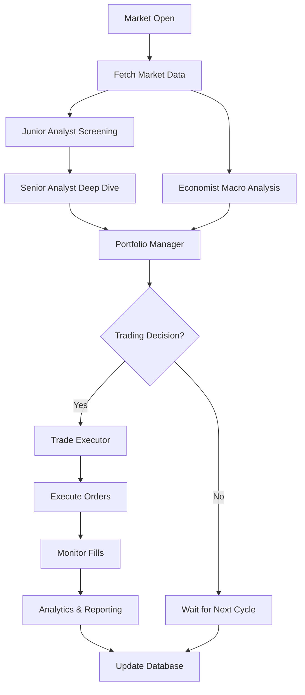

# AI Trading System - Architecture Documentation

## Table of Contents

1. [System Overview](#system-overview)
2. [Core Design Principles](#core-design-principles)
3. [System Architecture](#system-architecture)
4. [Agent Architecture](#agent-architecture)
5. [Data Flow & Processing](#data-flow--processing)
6. [Communication Patterns](#communication-patterns)
7. [Technology Stack](#technology-stack)
8. [Security Architecture](#security-architecture)
9. [Performance Considerations](#performance-considerations)
10. [Deployment Architecture](#deployment-architecture)

---

## System Overview

The AI Trading System is a sophisticated multi-agent platform that leverages artificial intelligence to make intelligent trading decisions. The system employs six specialized AI agents, each with distinct responsibilities, working in concert through an orchestration layer to analyze markets, manage risk, and execute trades.

### Key Characteristics

- **Event-Driven Architecture**: Agents respond to market events and inter-agent communications
- **Microservices-Inspired**: Each agent operates as an independent service with defined interfaces
- **AI-First Design**: Claude AI powers decision-making at every level
- **Risk-Centric**: Multiple layers of risk management and validation
- **Fault-Tolerant**: Comprehensive error handling and recovery mechanisms

## Core Design Principles

### 1. **Separation of Concerns**
Each agent has a single, well-defined responsibility. This ensures maintainability and allows for independent scaling and optimization.

### 2. **Defensive Programming**
Every component assumes failure is possible and implements appropriate fallback mechanisms.

### 3. **Immutable Decision Chain**
Once a decision passes through the pipeline, it's logged and immutable, creating an audit trail.

### 4. **Async-First**
All I/O operations are asynchronous to maximize throughput and responsiveness.

### 5. **Configuration-Driven**
Behavior can be modified through configuration without code changes.

## System Architecture

### High-Level Component Diagram

```
┌──────────────────────────────────────────────────────────────────┐
│                         External Systems                          │
├────────────────────┬─────────────────┬──────────────────────────┤
│   Alpaca Markets   │   Claude AI API  │   PostgreSQL/SQLite     │
└────────┬───────────┴────────┬────────┴────────┬─────────────────┘
         │                    │                  │
┌────────▼────────────────────▼──────────────────▼─────────────────┐
│                      Infrastructure Layer                         │
├────────────────────────────────────────────────────────────────────┤
│ • Data Providers  • LLM Provider  • Database Manager  • Logger   │
└────────────────────────────┬───────────────────────────────────────┘
                            │
┌────────────────────────────▼───────────────────────────────────────┐
│                     Orchestration Controller                       │
├────────────────────────────────────────────────────────────────────┤
│ • Workflow Engine  • Task Scheduler  • Event Bus  • State Manager │
└────────────────────────────┬───────────────────────────────────────┘
                            │
        ┌───────────────────┼───────────────────┐
        │                   │                   │
┌───────▼────────┐ ┌────────▼────────┐ ┌───────▼────────┐
│   Analysis     │ │   Execution     │ │   Monitoring   │
│   Pipeline     │ │   Pipeline      │ │   Pipeline     │
├────────────────┤ ├─────────────────┤ ├────────────────┤
│ • Junior       │ │ • Portfolio Mgr │ │ • Analytics    │
│ • Senior       │ │ • Trade Exec    │ │ • Reporting    │
│ • Economist    │ │                 │ │ • Alerting     │
└────────────────┘ └─────────────────┘ └────────────────┘
```

### Layer Descriptions

#### **Infrastructure Layer**
Provides core services and abstractions that all agents depend on:

- **Data Providers**: Market data ingestion and normalization
- **LLM Provider**: Claude AI integration with retry logic and caching
- **Database Manager**: Connection pooling and transaction management
- **Logger**: Centralized logging with multiple outputs

#### **Orchestration Layer**
Coordinates agent activities and manages system workflow:

- **Workflow Engine**: Defines and executes trading workflows
- **Task Scheduler**: Manages task dependencies and execution order
- **Event Bus**: Enables inter-agent communication
- **State Manager**: Maintains system state and recovery points

#### **Agent Layer**
Specialized AI agents that perform specific trading functions:

- **Analysis Pipeline**: Market analysis and opportunity identification
- **Execution Pipeline**: Risk management and trade execution
- **Monitoring Pipeline**: Performance tracking and reporting

## Agent Architecture

### Base Agent Framework

All agents inherit from a common base class that provides:

```python
class BaseAgent(ABC):
    """
    Foundation for all trading agents
    
    Provides:
    - LLM integration
    - Database access
    - Logging
    - Error handling
    - Performance tracking
    - Task processing
    """
    
    Core Methods:
    - initialize(): Setup agent resources
    - process(): Main task processing
    - validate_input(): Input validation
    - handle_error(): Error recovery
    - get_status(): Health check
    - cleanup(): Resource cleanup
```

### Agent Profiles

#### **1. Junior Research Analyst**

```yaml
Purpose: Initial market screening and opportunity identification
Capabilities:
  - Technical indicator analysis
  - Price pattern recognition
  - Volume analysis
  - Preliminary scoring

Input: Market data, screening criteria
Output: Filtered candidate list with scores
Decision Process:
  1. Fetch market data for universe
  2. Calculate technical indicators
  3. Apply screening filters
  4. Score candidates
  5. Rank by opportunity

Dependencies:
  - Alpaca Market Data API
  - TA-Lib for indicators
  - Claude for pattern analysis
```

#### **2. Senior Research Analyst**

```yaml
Purpose: Deep fundamental and strategic analysis
Capabilities:
  - Financial statement analysis
  - Competitive positioning assessment
  - Growth trajectory evaluation
  - Risk factor identification

Input: Junior analyst recommendations
Output: Detailed investment thesis with confidence scores
Decision Process:
  1. Receive candidate list
  2. Gather fundamental data
  3. Analyze with Claude AI
  4. Generate investment thesis
  5. Assign confidence scores

Dependencies:
  - Financial data providers
  - Claude for analysis
  - Historical database
```

#### **3. Economist Agent**

```yaml
Purpose: Macroeconomic analysis and market regime detection
Capabilities:
  - Economic indicator analysis
  - Market regime classification
  - Sector rotation signals
  - Risk environment assessment

Input: Economic data, market indicators
Output: Market regime and sector recommendations
Decision Process:
  1. Analyze economic indicators
  2. Evaluate market conditions
  3. Classify regime (Risk-On/Off/Neutral)
  4. Identify sector opportunities
  5. Set risk parameters

Regime Classification:
  - RISK_ON: VIX < 20, positive momentum
  - RISK_OFF: VIX > 30, negative sentiment
  - NEUTRAL: Mixed signals
  - TRANSITION: Regime change detected
```

#### **4. Portfolio Manager**

```yaml
Purpose: Risk management and position sizing
Capabilities:
  - Portfolio optimization
  - Risk allocation
  - Position sizing (Kelly Criterion)
  - Rebalancing decisions

Input: Analyst recommendations, economist insights
Output: Trading decisions with position sizes
Risk Framework:
  Position Limits:
    - Max position size: 5% of portfolio
    - Max sector exposure: 25%
    - Max correlation: 0.7
    - Daily loss limit: 2%
    - Min cash reserve: 10%

Kelly Criterion Formula:
  f* = (p * b - q) / b
  Where:
    f* = optimal fraction
    p = probability of win
    b = win/loss ratio
    q = probability of loss
```

#### **5. Trade Execution Agent**

```yaml
Purpose: Optimal order execution and management
Capabilities:
  - Order routing
  - Execution strategy selection
  - Slippage minimization
  - Partial fill handling

Input: Portfolio manager decisions
Output: Executed trades with fill reports
Execution Strategies:
  MARKET:
    - Immediate execution
    - Accept market price
    - Use for liquid stocks
  
  LIMIT:
    - Price improvement
    - May not fill
    - Use for less urgent
  
  TWAP:
    - Time-weighted execution
    - Minimize market impact
    - Split into intervals
  
  VWAP:
    - Volume-weighted execution
    - Follow market volume
    - Reduce slippage
  
  ICEBERG:
    - Hide large orders
    - Show small portions
    - Prevent front-running
```

#### **6. Analytics & Reporting Agent**

```yaml
Purpose: Performance monitoring and reporting
Capabilities:
  - Performance analytics
  - Risk metrics calculation
  - Report generation
  - Alert management

Input: Trading results, portfolio state
Output: Reports, alerts, performance metrics
Metrics Tracked:
  Performance:
    - Total/Daily/Weekly returns
    - Sharpe ratio
    - Win rate
    - Average win/loss
  
  Risk:
    - Current drawdown
    - VaR (Value at Risk)
    - Position concentration
    - Sector exposure
  
  Execution:
    - Slippage
    - Fill rate
    - Order timing
```

## Data Flow & Processing

### 1. **Daily Trading Workflow**



### 2. **Data Pipeline**

```python
# Data flow through the system
Market Data → Normalization → Analysis → Decision → Execution → Reporting

# Data transformations at each stage
Stage 1 (Raw):
  - OHLCV data
  - Order book
  - News feeds

Stage 2 (Normalized):
  - Standardized format
  - Missing data handled
  - Outliers detected

Stage 3 (Enriched):
  - Technical indicators
  - Fundamental metrics
  - Sentiment scores

Stage 4 (Analyzed):
  - AI insights
  - Risk scores
  - Recommendations

Stage 5 (Decisions):
  - Position sizes
  - Entry/exit points
  - Risk limits

Stage 6 (Results):
  - Execution quality
  - Performance metrics
  - Reports
```

## Communication Patterns

### 1. **Inter-Agent Communication**

```python
# Event-driven messaging
class AgentMessage:
    sender: str          # Agent identifier
    recipient: str       # Target agent
    message_type: str    # TASK, RESULT, ERROR, STATUS
    payload: Dict        # Message data
    timestamp: datetime  # Message time
    correlation_id: str  # Track related messages
```

### 2. **Task Distribution**

```python
# Task assignment pattern
Orchestrator → Agent:
{
    "task_id": "uuid",
    "task_type": "ANALYZE_STOCK",
    "priority": "HIGH",
    "timeout": 300,
    "data": {...},
    "dependencies": ["task_id_1", "task_id_2"]
}

# Task result pattern
Agent → Orchestrator:
{
    "task_id": "uuid",
    "status": "COMPLETED",
    "result": {...},
    "execution_time": 145.3,
    "metadata": {...}
}
```

### 3. **Error Propagation**

```python
# Error handling chain
Agent Error → Local Handler → Orchestrator → Recovery Strategy

Recovery Strategies:
1. RETRY: Retry with backoff
2. FALLBACK: Use alternative method
3. SKIP: Skip and continue
4. HALT: Stop workflow
5. ALERT: Notify operators
```

## Technology Stack

### Core Technologies

| Component | Technology | Purpose |
|-----------|------------|---------|
| **Language** | Python 3.9+ | Primary development language |
| **AI/LLM** | Claude (Anthropic) | Decision intelligence |
| **Trading API** | Alpaca Markets | Market data & execution |
| **Database** | PostgreSQL/SQLite | Data persistence |
| **ORM** | SQLAlchemy 2.0 | Database abstraction |
| **Async** | asyncio/aiohttp | Concurrent operations |
| **Data Analysis** | Pandas/NumPy | Data manipulation |
| **Testing** | Pytest | Test framework |
| **Logging** | Python logging | System monitoring |

### Key Libraries

```python
# requirements.txt breakdown
alpaca-trade-api==3.0.2    # Trading API client
anthropic==0.7.0           # Claude AI SDK
sqlalchemy==2.0.23         # Database ORM
pandas==2.1.3              # Data analysis
numpy==1.25.2              # Numerical computing
ta-lib==0.4.28             # Technical indicators
aiohttp==3.8.2             # Async HTTP client
pytest==7.4.3              # Testing framework
python-dotenv==1.0.0       # Environment management
```

## Security Architecture

### 1. **API Key Management**

```python
# Secure credential handling
Environment Variables:
  - Never hardcoded
  - Loaded from .env
  - Rotated regularly
  
Access Control:
  - Principle of least privilege
  - Agent-specific permissions
  - Audit logging
```

### 2. **Data Protection**

```python
# Data security measures
In Transit:
  - HTTPS for all APIs
  - TLS for database
  - Encrypted messages
  
At Rest:
  - Encrypted database
  - Secure file storage
  - Hashed sensitive data
  
Access:
  - Authentication required
  - Session management
  - Rate limiting
```

### 3. **Risk Controls**

```python
# Trading risk controls
Position Limits:
  - Max position size check
  - Sector concentration limit
  - Correlation analysis
  
Order Validation:
  - Price reasonableness
  - Size limits
  - Time restrictions
  
Circuit Breakers:
  - Daily loss limit
  - Drawdown threshold
  - Unusual activity detection
```

## Performance Considerations

### 1. **Optimization Strategies**

```python
# Performance optimizations
Caching:
  - LLM response cache (5 min TTL)
  - Market data cache (1 min TTL)
  - Database query cache
  
Batching:
  - Bulk database inserts
  - Grouped API calls
  - Batch order submissions
  
Async Operations:
  - Concurrent agent processing
  - Non-blocking I/O
  - Parallel data fetching
```

### 2. **Scalability Design**

```python
# Horizontal scaling approach
Agent Pool:
  - Multiple agent instances
  - Load distribution
  - Failover support
  
Database:
  - Connection pooling
  - Read replicas
  - Query optimization
  
Message Queue (Future):
  - RabbitMQ/Redis
  - Async task processing
  - Event streaming
```

### 3. **Performance Metrics**

```python
# System performance tracking
Latency Targets:
  - Market data: < 100ms
  - LLM response: < 5s
  - Order execution: < 500ms
  - Database query: < 50ms
  
Throughput:
  - 100+ symbols/minute screening
  - 10+ trades/minute execution
  - 1000+ messages/second
  
Resource Usage:
  - CPU: < 70% average
  - Memory: < 4GB
  - Database connections: < 20
```

## Deployment Architecture

### 1. **Development Environment**

```yaml
Configuration:
  - SQLite database
  - Paper trading API
  - Debug logging
  - Mock LLM option
  
Tools:
  - Hot reload
  - Debug endpoints
  - Test data generator
  - Performance profiler
```

### 2. **Production Environment**

```yaml
Configuration:
  - PostgreSQL cluster
  - Live trading API
  - Error logging only
  - Production LLM
  
Infrastructure:
  - Docker containers
  - Kubernetes orchestration
  - Load balancer
  - Monitoring stack
```

### 3. **Deployment Pipeline**

```yaml
CI/CD Flow:
  1. Code commit
  2. Automated tests
  3. Build Docker image
  4. Deploy to staging
  5. Integration tests
  6. Deploy to production
  7. Health checks
  8. Rollback if needed

Monitoring:
  - Prometheus metrics
  - Grafana dashboards
  - Alert manager
  - Log aggregation
```

### 4. **High Availability**

```yaml
Redundancy:
  - Multi-region deployment
  - Database replication
  - Agent failover
  - Backup systems

Recovery:
  - Automated restarts
  - State recovery
  - Transaction replay
  - Data reconciliation
```

## Future Architecture Enhancements

### Phase 1: Message Queue Integration
- Implement RabbitMQ/Kafka for agent communication
- Decouple agents for better scalability
- Enable event replay capability

### Phase 2: Machine Learning Pipeline
- Add ML model training infrastructure
- Implement backtesting framework
- Create feature engineering pipeline

### Phase 3: Microservices Migration
- Containerize each agent separately
- Implement service mesh
- Add API gateway

### Phase 4: Advanced Analytics
- Real-time dashboard
- Advanced risk analytics
- Predictive performance modeling

## Conclusion

This architecture provides a robust, scalable foundation for an AI-powered trading system. The modular design allows for independent evolution of components while maintaining system coherence. The emphasis on risk management, monitoring, and fault tolerance ensures production readiness.

Key architectural advantages:
- **Modularity**: Easy to extend and modify
- **Resilience**: Multiple failure recovery mechanisms
- **Scalability**: Horizontal scaling capabilities
- **Observability**: Comprehensive monitoring and logging
- **Security**: Multiple layers of protection

---

*For implementation details, see the [API Reference](../api/reference.md) and [Developer Guide](../guides/development.md).*